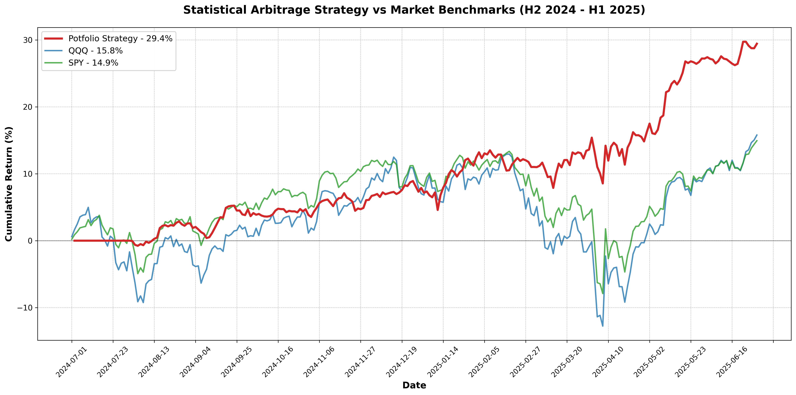

# Cointegration Trading Analysis - An Extenstion of Traditional Pairs Trading

> Systematic exploration of mean-reversion strategies combining traditional and non-traditional pairs-trading to achieve superior risk-adjusted returns

---

## 🎯 Project Overview

This project investigates pairs trading strategies using cointegration-based statistical arbitrage. The key innovation is comparing and combining **traditional pairs** (positive hedge ratio) with **non-traditional pairs** (negative hedge ratio) and demonstrating that portfolio diversification across relationship types produces superior risk-adjusted returns. The dataset used contains daily data on the S&P 500 universe, including QQQ and SPY as benchmarks, between 01/01/2021 - 06/30/2025. A training period of 01/01/2021-06/30/2024 was used to detect cointegration and extract hedge ratios; A testing period of 07/01/2024 - 06/30/2025 was used to the resulting strategies and compare metrics (Return, Sharpe, Volatility, Drawdown) against benchmark Buy-and-hold strategies.

**Main Findings:**
- Non-traditional pairs generated 39.59% returns but with 20.19% volatility (Sharpe 1.78)
- Traditional pairs generated 18.81% returns with 10.18% volatility (Sharpe 1.46)
- Equal-weight combination achieved 29.44% returns with 12.34% volatility (**Sharpe 2.08**)
- Strategy outperformed S&P 500 by 14.5pp with 68% less drawdown, and ~4x the Sharpe 
- *Note all Sharpe Ratios use a 4.1% Risk-Free Rate

---

## 🚀 Quick Start

### Prerequisites
- Python 3.8+
- pip or conda

### Installation
```bash
# Clone repository
git clone https://github.com/oalkhadra/pairs-trading.git
cd pairs-trading

# Install dependencies
pip install -r requirements.txt
```

### Run Analysis
**Step 1: Download Historical Data**
```bash
python src/data_loader.py
```
Downloads price data for benchmarks and S&P 500 constituents from Yahoo Finance (2021-2025). Data saved to `data/` directory.

**Step 2: Test for Cointegration**
```bash
python src/cointegration.py
```
Runs Johansen and ADF tests on all XOM-stock pairs. Identifies cointegrated pairs with stationary spreads and calculates statistical properties (hedge ratios, half-lives, p-values). Results saved to `data/cointegrated_pairs.csv`.

**Step 3: Select Trading Pairs**
```bash
jupyter notebook notebooks/pair_selection.ipynb
```
Interactive notebook for stratified pair selection:
- Separates pairs by hedge ratio sign (traditional vs. non-traditional)
- Selects 3 pairs from each basket by half-life (fast, medium, slow)

**Step 4: Generate Trading Signals**
```bash
python src/signals.py
```
Calculates spreads and generates entry/exit signals for test period (Jul 2024 - Jun 2025) using ±2σ thresholds. Signals saved for each pair.

**Step 5: Backtest Individual Strategies**
```bash
python src/backtester.py
```
Runs backtests for all 6 pairs independently, applying transaction costs (15 bps per leg for conservative testing). Outputs individual pair performance metrics and daily returns.

**Step 6: Visualize Individual Results**
```bash
jupyter notebook notebooks/initial_backtest_visualizations.ipynb
```
Analyzes each pair's performance:
- Equity curves
- Portfolio statistics
- Comparison to benchmarks (SPY, QQQ)

**Step 7: Construct & Analyze Portfolio**
```bash
jupyter notebook notebooks/portfolio_assessment.ipynb
```
Final portfolio analysis:
- Aggregates 6 pairs into equal-weighted portfolio
- Ability to compare traditional-only, non-traditional-only, and alternative portfolio weights
- Generates performance tables and cumulative return charts
- Exports results to `results/` directory

---

## 🔬 Methodology

### 1. Pair Identification
- **Universe:** XOM vs. S&P 500 constituents
- **Training Period:** Jan 2021 - Jun 2024 (3.5 years)
- **Testing Period:** Jul 2024 - Jun 2025 (12 months, out-of-sample)
- **Cointegration Test:** Johansen test with p < 0.05, followed by Augmented Dickey-Fuller (ADF) test with p < 0.01 on candidate pairs for stationarity
- **Result:** 34 cointegrated pairs identified, 33 of which were stationary

### 2. Pair Selection
Stratified sampling across mean-reversion speeds and relationship types:
- **3 Traditional Pairs** (positive beta): Fast, medium, slow half-life
- **3 Non-Traditional Pairs** (negative beta): Fast, medium, slow half-life

**Selection Criteria:**
1. Cointegration significance (primary filter)
2. Stationarity of Spreads (secondary filter)
3. Half-life of mean reversion (stratification of two baskets [traditional vs non-traditional])
4. OLS R² (tie-breaker)

### 3. Trading Rules
- **Entry:** Spread exceeds ±2σ threshold
- **Exit:** Spread returns to mean
- **Position Sizing:** Equal capital allocation across all pairs
- **Transaction Costs:** 15 bps per leg (conservative assumption to account for slippage, margin interest, etc.)
- **Hedge Ratios:** Static throughout test period (estimated from training data)

### 4. Risk Management
- Stop-loss at ±3σ
- Half of portfolio contains traditional pairs (Hedged positioning)

### 5. Return Analysis
- Benchmarks used: QQQ and SPY
- Cumulative return comparison
- Annualized return, Sharpe Ratio, Volatility, and Maximum Drawdown metrics compared against benchmarks

---

## 📊 Key Results

### Portfolio Performance (Out-of-Sample: Jul 2024 - Jun 2025)

| Metric | Portfolio | S&P 500 | QQQ | Outperformance vs SPY |
|--------|-----------|---------|-----|------------------------|
| Total Return | 29.4% | 14.9% | 15.8% | +14.5pp |
| Sharpe Ratio | 2.08 | 0.53 | 0.46 | 3.9x |
| Max Drawdown | -5.9% | -18.8% | -22.8% | +12.9pp |
| Volatility | 12.3% | 20.6% | 25.6% | -40% |

### Cumulative Returns


*Portfolio (red) vs. market benchmarks showing strong hedge-potential during April tariff correction*

### Diversification Benefit

| Strategy | Return | Vol | Sharpe | Max DD |
|----------|--------|-----|--------|--------|
| Traditional Only | 18.8% | 10.2% | 1.46 | -4.7% |
| Non-Traditional Only | 39.6% | 20.2% | 1.78 | -9.7% |
| **50/50 Mix (Final)** | **29.4%** | **12.3%** | **2.08** | **-5.9%** |

*Equal-weight combination achieves superior risk-adjusted returns vs. either component*

### Individual Pair Performance

| Pair | Type | Half-Life | Test Return | Test Volatility |
|------|------|-----------|-------------|------------------------|
| KMX | Non-Traditional | 15.9d | +118.1% | 33.07% |
| TRMB | Non-Traditional | 22.2d | +10.4% | 34.29% |
| FRT | Non-Traditional | 31.9d | +5.0% | 20.52% |
| ATO | Traditional | 18.2d | +6.4% | 13.05% |
| DE | Traditional | 20.6d | +54.0% | 22.06% |
| REG | Traditional | 31.7d | -0.2% | 13.25% |

---

## 📁 Repository Structure
```
├── src/                    # Core logic
│   ├── data_loader.py          # Yfinance API call
│   ├── cointegration.py        # Statistical tests
│   ├── signals.py              # Signal generation for test period
│   ├── backtester.py           # Backtesting engine for individual strategies (6 unique strategies to comprise portfolio)
│   └── portfolio_creation.py   # Merging strategies into single portoflio and metric calculations
│
├── notebooks/                # Analysis workflow
│   ├── pair_selection.ipynb                    # Notebook splitting candidate pairs into traditional and non-traditional; Allowing for selection of tradeable pairs
│   ├── inital_backtest_visualizations.ipynb    # Backtesting analysis on single-pair strategies, with visualizations and benchmark comparisons
│   └── portfolio_assessment.ipynb              # Complete portfolio analysis with configurable allocation strategies and performance comparison
│
├── results/               # Outputs
│   ├── performance_metrics_formatted.xlsx      # Formatted excel showcasing Traditional only, Non-traditional only, and equally weighted portfolios against benchmarks
│   ├── performance_metrics.xlsx                # Individual portfolio comparison against benchmarks, generated in portfolio_assessment.ipynb
│   └── cumulative_returns_comparison.png       # Individual portfolio equity curves against benchmarks, generated in portfolio_assessment.ipynb
└── docs/
    └── methodology.md     # Detailed explanation of strategy methodology, as well as detailed analysis of results
```
---


## ⚠️ Limitations & Future Work

### Limitations
**1. Limited Test Period:** The 12-month out-of-sample period provides only 
preliminary evidence of strategy effectiveness. Testing across multiple market 
cycles and regime types is necessary to establish robustness.

**2. Static Parameters:** Hedge ratios remained fixed throughout the test period. 
Real-world implementation would likely benefit from periodic re-estimation as 
cointegrating relationships evolve.

**3. Concentration Risk:** Two pairs (KMX, DE) generated 87% of returns, indicating 
significant concentration. This dependence on specific pairs suggests selection 
methodology could be refined or that most cointegrated pairs lack consistent 
profitability.

**4. Small Sample:** Testing only 6 of 33 available pairs limits statistical 
inference about selection criteria effectiveness. Larger sample sizes are needed 
to validate the half-life stratification approach.

**5. Absence of Dynamic Risk Management:** The strategy lacks adaptive position 
sizing, concentration limits, or mechanisms to exit pairs showing cointegration 
breakdown. Professional implementations would include these risk controls.

---

## 📧 Contact

**Omar Alkhadra**  
[LinkedIn](https://www.linkedin.com/in/oalkhadra/) | [Email](mailto:omar.alkhadra@outlook.com)

---

## 📄 License

MIT License - feel free to use this code for educational or personal exploration purposes.

---

## 📚 References

### Textbooks
- G. Vidyamurthy, Pairs Trading: Quantitative Methods and Analysis. Hoboken, NJ, USA: John Wiley & Sons, 2004

### Data Sources
- Yahoo Finance via yfinance Python library (Aroussi, 2019-2024)
